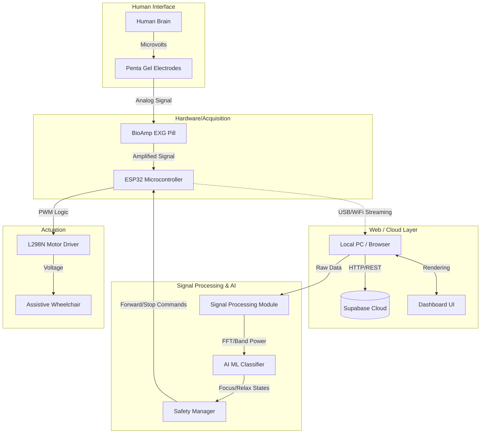
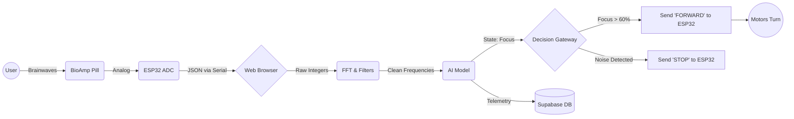
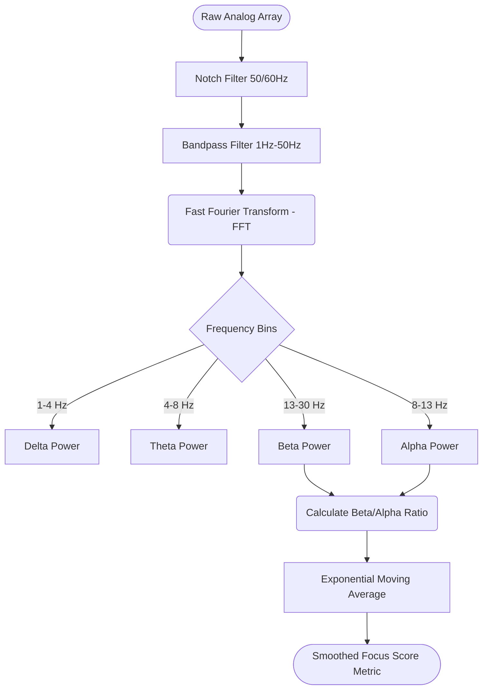
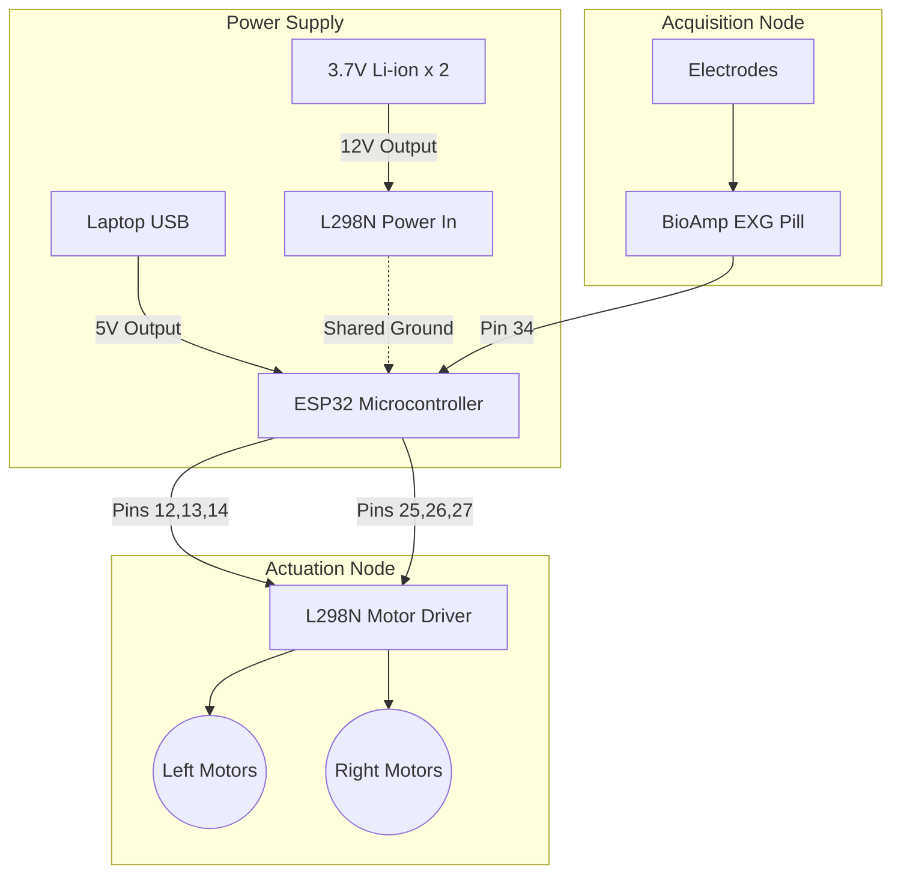
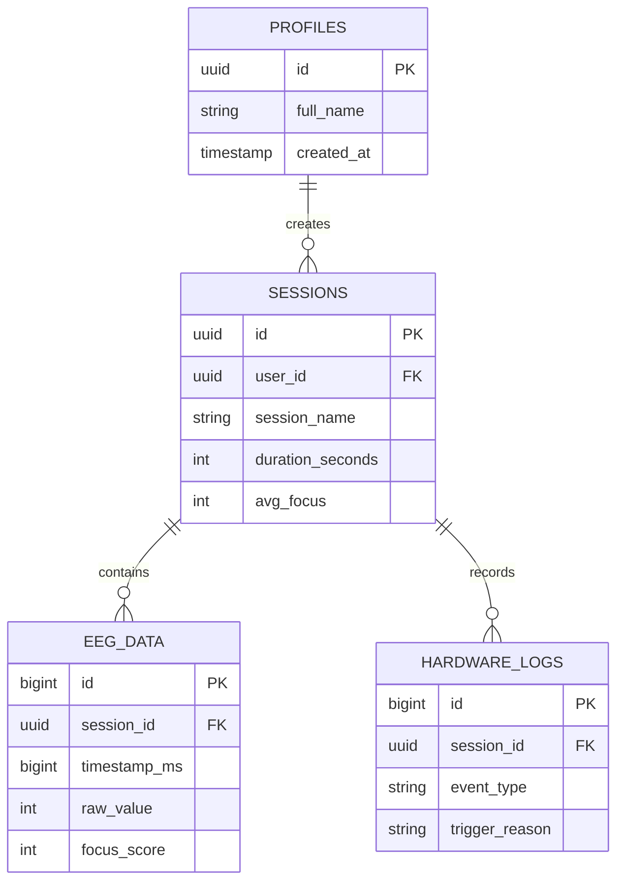

# Neurovex Diagram Generation Prompts & Code

If you want to quickly generate high-quality engineering diagrams for your project report, you have two options:

---

## OPTION 1: Use Mermaid.js (Highly Recommended)
This is the fastest and most professional way. Mermaid generates exact shapes and arrows instantly without typos.
**Instructions:**
1. Go to [https://mermaid.live/](https://mermaid.live/)
2. Copy the code block for each diagram below and paste it into the "Code" section on the left side of the website.
3. Click the "Download PNG" button on the right side to save the image.
4. Insert the image into your Word Document report.

### Diagram 1: System Architecture Diagram

### Diagram 2: Data Flow Diagram (DFD)

### Diagram 3: EEG Signal Processing Flow

### Diagram 4: Hardware Block Diagram

### Diagram 5: Database Architecture

---

## OPTION 2: Use ChatGPT/Claude to Generate Image Prompts or Diagrams
If you prefer to use ChatGPT to generate diagrams or write descriptions for your report, copy and paste this prompt into ChatGPT:

**PROMPT TO COPY AND PASTE:**
> "I am writing an engineering report for my Final Year Project named Neurovex (an AI-powered EEG Brain-Computer Interface for Wheelchair control). I need 5 detailed, professional block diagrams focusing on these sections:
> 1. System Architecture (showing the Brain, ESP32, React Frontend, AI ML Classifier, Supabase, and Motor Driver).
> 2. Data Flow Diagram (DFD) showing how the data moves from the BioAmp Pill through the Serial API to the dashboard and motors.
> 3. EEG Signal Processing Flow (highlighting FFT, Bandpass filters, and Alpha/Beta wave extraction).
> 4. Hardware Block Diagram (showing power routing from batteries to the L298N and ESP32 with a shared ground).
> 5. Supabase Database Entity Relationship (ER) Diagram (showing Profiles, Sessions, EEG_Data, and Hardware Logs).
> 
> Please output the Mermaid.js code for these 5 diagrams so I can render them. After outputting the code, please write a 1-paragraph academic summary for each diagram explaining its parts and data flow so I can paste the descriptions directly into my report below the images."
